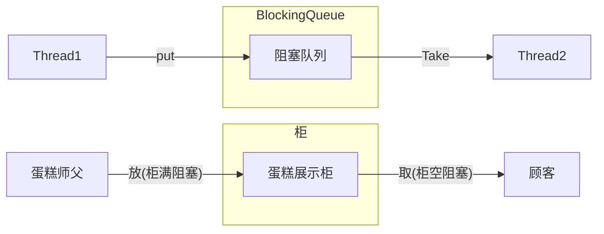
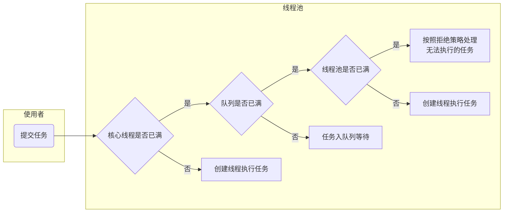
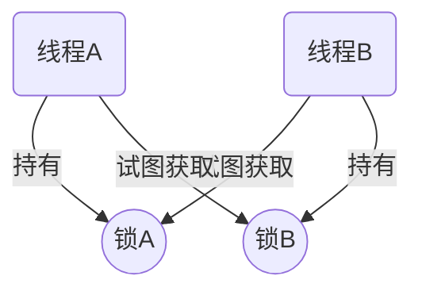

## JUC多线程及高并发

[TOC]

### 一、谈谈你对volatile的理解

#### 1、volatile是Java虚拟机提供的轻量级的同步机制

保证可见性、不保证原子性、禁止指令重排

1. 保证可见性

   当多个线程访问同一个变量时，一个线程修改了这个变量的值，其他线程能够立即看到修改的值
   
   当不添加volatile关键字时示例：
   
   ```java
   package com.kevin.juc.volatileTest;
   
   import java.util.concurrent.TimeUnit;
   
   /**
    * 1. 验证volatile的可见性
    *  1.1 假如 int number = 0；number变量之前根本没有添加volatile关键字修饰
    *  1.2 添加了volatile，可以解决可见性问题
    * @author: Kevin
    * @createDate: 2020/2/13
    * @version: 1.0
    */
   public class VolatileDemo {
   
       public static void main(String[] args) {
           visibilityByVolatile();//验证volatile的可见性
       }
   
       /**
        * volatile可以保证可见性，及时通知其他线程，主物理内存的值已经被修改
        */
       public static void visibilityByVolatile() {
           MyData myData = new MyData();
   
           //第一个线程
           new Thread(() -> {
               System.out.println(Thread.currentThread().getName() + "\t come in");
               try {
                   //线程暂停3s
                   TimeUnit.SECONDS.sleep(3);
                   myData.addToSixty();
                   System.out.println(Thread.currentThread().getName() + "\t update value:" + myData.num);
               } catch (Exception e) {
                   e.printStackTrace();
               }
           }, "thread1").start();
           //第二个线程是main线程
           while (myData.num == 0) {
               //如果myData的num一直为零，main线程一直在这里循环
           }
           System.out.println(Thread.currentThread().getName() + "\t mission is over, num value is " + myData.num);
       }
   }
   
   class MyData {
   //    int num = 0;
       volatile int num = 0;
   
       public void addToSixty() {
           this.num = 60;
       }
   }
   ```
   
   输出结果：

   ```java
   thread1	 come in
   thread1	 update value:60
   //main线程监听不到num的变化，进入死循环
   ```

   当我们加上`volatile`关键字后，`volatile int num = 0;`输出结果为：

   ```java
   thread1	 come in
   thread1	 update value:60
   main	 mission is over, num value is 60
   //main线程监听到num的变化，程序没有死循环，结束执行
   ```


2. ==不保证原子性==

   原子性：不可分割、完整性，即某个线程正在做某个具体业务时，中间不可以被加塞或者被分割，需要整体完整，要么同时成功，要么同时失败
   
   验证示例（变量添加volatile关键字，方法不添加synchronized）：
   
   ```java
   package com.kevin.juc.volatileTest;
   
   import java.util.concurrent.TimeUnit;
   import java.util.concurrent.atomic.AtomicInteger;
   
   /**
    * 2. 验证volatile不保证原子性
    *  2.1 原子性：不可分割，完整性。
    *      也即某个线程正在做某个业务，不可被加塞或者被分割。需要整体完整。
    *      要么同时成功，要么同时失败。
    *  2.2 why：线程加塞导致数据覆盖
    *  2.3 如何解决：
    *     2.3.1 加synchronized (没必要，synchronized重量级)
    *     2.3.2 使用juc下AtomicInteger
    * @author: Kevin
    * @createDate: 2020/2/13
    * @version: 1.0
    */
   public class VolatileDemo {
   
       public static void main(String[] args) {
           atomicByVolatile();//验证volatile不保证原子性
       }
   
       /**
        * volatile不保证原子性
        * 以及使用Atomic保证原子性
        */
       public static void atomicByVolatile(){
           MyData myData = new MyData();
           for(int i = 1; i <= 20; i++){
               new Thread(() ->{
                   for(int j = 1; j <= 1000; j++){
                       myData.addSelf();
                       myData.atomicAddSelf();
                   }
               },"Thread "+i).start();
           }
           //等待上面的线程都计算完成后，再用main线程取得最终结果值
           try {
               TimeUnit.SECONDS.sleep(4);
           } catch (InterruptedException e) {
               e.printStackTrace();
           }
           while (Thread.activeCount()>2){
               Thread.yield();
           }
           System.out.println(Thread.currentThread().getName()+"\t finally num value is "+myData.num);
           System.out.println(Thread.currentThread().getName()+"\t finally atomicnum value is "+myData.atomicInteger);
       }
   }
   
   class MyData {
   //    int num = 0;
       volatile int num = 0;
   
       public void addSelf(){
           num++;
       }
   
       AtomicInteger atomicInteger = new AtomicInteger();
       public void atomicAddSelf(){
           atomicInteger.getAndIncrement();
       }
   }
   ```
   
   执行三次结果为：
   
   ```java
   //1.
   main	 finally num value is 19011	
   main	 finally atomicnum value is 20000
   //2.
   main	 finally num value is 19751
   main	 finally atomicnum value is 20000
   //3.
   main	 finally num value is 18375
   main	 finally atomicnum value is 20000
   //加volatile的num并没有达到20000
   //AtomicInteger保证了数据完整
   ```
   
   

3. 禁止指令重排

   有序性：在计算机执行程序时，为了提高性能，编译器和处理器常常会对**==指令做重排==**，一般分以下三种
   
   ```mermaid
   graph LR
   	源代码 --> id1["编译器优化的重排"]
   	id1 --> id2[指令并行的重排]
   	id2 --> id3[内存系统的重排]
   	id3 --> 最终执行的指令
   	style id1 fill:#ff8000;
   	style id2 fill:#fab400;
   	style id3 fill:#ffd557;
   ```

   单线程环境里面确保程序最终执行结果和代码顺序执行的结果一致。

   处理器在进行重排顺序是必须要考虑指令之间的**==数据依赖性==**

   ==多线程环境中线程交替执行，由于编译器优化重排的存在，两个线程中使用的变量能否保证一致性时无法确定的，结果无法预测==
   
   重排代码实例：

   声明变量：`int a,b,x,y=0`

   | 线程1          | 线程2          |
   | -------------- | -------------- |
   | x = a;         | y = b;         |
   | b = 1;         | a = 2;         |
   | 结          果 | x = 0      y=0 |

   如果编译器对这段程序代码执行重排优化后，可能出现如下情况：

   | 线程1          | 线程2          |
   | -------------- | -------------- |
   | b = 1;         | a = 2;         |
   | x= a;          | y = b;         |
   | 结          果 | x = 2      y=1 |

   这个结果说明在多线程环境下，由于编译器优化重排的存在，两个线程中使用的变量能否保证一致性是无法确定的

   volatile实现禁止指令重排，从而避免了多线程环境下程序出现乱序执行的现象

   **==内存屏障==**（Memory Barrier）又称内存栅栏，是一个CPU指令，他的作用有两个：

   1. 保证特定操作的执行顺序
   2. 保证某些变量的内存可见性（利用该特性实现volatile的内存可见性）

   由于编译器和处理器都能执行指令重排优化。如果在之零件插入一i奥Memory Barrier则会告诉编译器和CPU，不管什么指令都不能和这条Memory Barrier指令重排顺序，也就是说==通过插入内存屏障禁止在内存屏障前后的指令执行重排序优化==。内存屏障另外一个作用是强制刷出各种CPU的缓存数据，因此任何CPU上的线程都能读取到这些数据的最新版本。

   ```mermaid
   graph TB
       subgraph 
       bbbb["对Volatile变量进行读操作时，<br>回在读操作之前加入一条load屏障指令，<br>从内存中读取共享变量"]
       ids6[Volatile]-->red3[LoadLoad屏障]
       red3-->id7["禁止下边所有普通读操作<br>和上面的volatile读重排序"]
       red3-->red4[LoadStore屏障]
       red4-->id9["禁止下边所有普通写操作<br>和上面的volatile读重排序"]
       red4-->id8[普通读]
       id8-->普通写
       end
       subgraph 
       aaaa["对Volatile变量进行写操作时，<br>回在写操作后加入一条store屏障指令，<br>将工作内存中的共享变量值刷新回到主内存"]
       id1[普通读]-->id2[普通写]
       id2-->red1[StoreStore屏障]
       red1-->id3["禁止上面的普通写和<br>下面的volatile写重排序"]
       red1-->id4["Volatile写"]
       id4-->red2[StoreLoad屏障]
       red2-->id5["防止上面的volatile写和<br>下面可能有的volatile读写重排序"]
       end
       style red1 fill:#ff0000;
       style red2 fill:#ff0000;
       style red4 fill:#ff0000;
       style red3 fill:#ff0000;
       style aaaa fill:#ffff00;
       style bbbb fill:#ffff00;
   ```
   
   
   
#### 2、JMM（Java Memory Model, Java内存模型）

JMM本身是一种抽象的概念，并不真实存在，他描述的时一组规则或规范，通过这组规范定义了程序中各个变量（包括实例字段，静态字段和构成数组对象的元素）的访问方式。

**JMM关于同步的规定**

1. 线程解锁前，必须把共享变量的值刷新回主内存
2. 线程加锁前，必须读取主内存的最新值到自己的工作内存
3. 加锁解锁时同一把锁

由于JVM运行程序的实体是线程，而每个线程创建时JVM都会为其创建一个工作内存（有的成为栈空间），工作内存是每个线程的私有数据区域，而java内存模型中规定所有变量都存储在**==主内存==**，主内存是贡献内存区域，所有线程都可以访问，**==但线程对变量的操作（读取赋值等）必须在工作内存中进行，首先概要将变量从主内存拷贝到自己的工作内存空间，然后对变量进行操作，操作完成后再将变量写回主内存，==**不能直接操作主内存中的变量，各个线程中的工作内存中存储着主内存的**==变量副本拷贝==**，因此不同的线程件无法访问对方的工作内存，线程间的通信（传值）必须通过主内存来完成，期间要访问过程如下图：


1. 可见性
2. 原子性
3. 有序性


#### 3、你在哪些地方用过volatile

当普通单例模式在多线程情况下：

```java
public class SingletonDemo {

    private static SingletonDemo instance = null; 

    private SingletonDemo(){
        System.out.println(Thread.currentThread().getName()+"\t 我是构造方法SingletonDemo()");
    }

    public static SingletonDemo getInstance(){
        if (instance == null){
               instance = new SingletonDemo();
            }
        }
        return instance;
    }

    public static void main(String[] args) {

        //单线程，构造方法只会被执行一次
//        System.out.println(getInstance() == getInstance());
//        System.out.println(getInstance() == getInstance());
//        System.out.println(getInstance() == getInstance());

        //并发多线程，构造方法会在一些情况下执行多次
        for (int i = 1; i <= 10; i++) {
            new Thread(() -> {
                SingletonDemo.getInstance();
            }, "Thread " + i).start();
        }
    }

}
```

其构造方法在一些情况下会被执行多次。

解决方法：

1. **单例模式DCL代码**

   DCL （Double Check Lock双端检锁机制）在加锁前和加锁后都进行一次判断
   
   ```java
   //    public static synchronized SingletonDemo getInstance(){ 可以直接在方法前加synchronized，但是锁了整个方法，没必要
    public static SingletonDemo getInstance(){
        if (instance == null){
            synchronized (SingletonDemo.class){ // DCL(Double Check Lock 双端检锁机制)，但是由于存在指令重排，所以需要加volatile
                if (instance == null){
                    instance = new SingletonDemo();
                }
            }
        }
        return instance;
    }
   ```
   
   **大部分运行结果构造方法只会被执行一次**，但指令重排机制会让程序很小的几率出现构造方法被执行多次
   
   **==DCL（双端检锁）机制不一定线程安全==**，原因时有指令重排的存在，加入volatile可以禁止指令重排
   
   原因是在某一个线程执行到第一次检测，读取到instance不为null时，instance的引用对象可能==没有完成初始化==。instance=new SingleDemo();可以被分为一下三步（伪代码）：
   
   ```java
   memory = allocate();//1.分配对象内存空间
   instance(memory);	//2.初始化对象
   instance = memory;	//3.设置instance执行刚分配的内存地址，此时instance!=null
   ```
   
   步骤2和步骤3不存在数据依赖关系，而且无论重排前还是重排后程序的执行结果在单线程中并没有改变，因此这种重排优化时允许的，**如果3步骤提前于步骤2，但是instance还没有初始化完成**
   
   但是指令重排只会保证串行语义的执行的一致性（单线程），但并不关心多线程间的语义一致性。
   
   ==所以当一条线程访问instance不为null时，由于instance示例未必已初始化完成，也就造成了线程安全问题。==
   
   ```java
   // 例子理解
   // 1.安排位置、2.人坐座位、3.找人。正常情况 1 2 3
   // 1.安排位置、2.找人、3.人坐座位。重排后，对象还没初始化完成(人还没坐到座位上)
   ```
   
2. **单例模式volatile代码**
   
   为解决以上问题，可以将SingletongDemo实例上加上volatile
   
   ```java
   private static volatile SingletonDemo instance = null; // 加volatile 禁止指令重排！
   ```
   
   
   
### 二、CAS你知道吗

CAS ==> Unsafe ==> CAS底层 ==> ABA ==> 原子更新引用 ==> 如何规避ABA问题

#### 1、CompareAndSwap----比较并交换

如：AtomicInteger.conpareAndSet(int expect, indt update)

```java
    public final boolean compareAndSet(int expect, int update) {
        return unsafe.compareAndSwapInt(this, valueOffset, expect, update);
    }
```

第一个参数为拿到的期望值，如果期望值没有一致，进行update赋值，如果期望值不一致，证明数据被修改过，返回fasle，取消赋值

例子：

```java
package com.kevin.juc.cas;

import java.util.concurrent.atomic.AtomicInteger;

/**
 * @description: CAS
 * 1. CAS 是什么 ？==》 CompareAndSwap
 *    比较并交换
 * @author: Kevin
 * @createDate: 2020/2/24
 * @version: 1.0
 */
public class CASDemo {
    public static void main(String[] args) {
        AtomicInteger atomicInteger = new AtomicInteger(5);

        System.out.println(atomicInteger.compareAndSet(5, 2020)+"\t current data:"+atomicInteger.get());
        System.out.println(atomicInteger.compareAndSet(5, 1024)+"\t current data:"+atomicInteger.get());
    }
}
```

输出结果为：

```java
true	 current data:2020
false	 current data:2020
```

#### 2、CAS底层原理？对Unsafe的理解

比较当前工作内存中的值和主内存中的值，如果相同则执行规定操作，否则继续比较直到工作内存和主内存中的值相同为止。

1. AtomicInteger
   ```java
   public class AtomicInteger extends Number implements java.io.Serializable {
       private static final long serialVersionUID = 6214790243416807050L;

       // setup to use Unsafe.compareAndSwapInt for updates
       private static final Unsafe unsafe = Unsafe.getUnsafe();
       private static final long valueOffset;

       static {
           try {
               valueOffset = unsafe.objectFieldOffset
                   (AtomicInteger.class.getDeclaredField("value"));
           } catch (Exception ex) { throw new Error(ex); }
       }

       private volatile int value;
       ...
   }
   ```

   - 变量`value`用`volatile`修饰，保证多线程之间的可见性
   - 变量`valueOffset`，表示该变量值在内存中的**偏移地址**，因为Unsafe就是根据内存偏移地址获取数据的
   
   **atomicInteger.getAndIncrement();**
   
   ```java
   public final int getAndIncrement() {
       return unsafe.getAndAddInt(this, valueOffset, 1);
       						// 当前对象，内存偏移量，自增值
   }
   ```
   
2. Unsafe

   **unsafe.getAndAddInt**

   ```java
   public final int getAndAddInt(Object var1, long var2, int var4) {
       				// AtomicInteger对象本身，内存偏移量，自增值
       int var5;
       do {
           var5 = this.getIntVolatile(var1, var2); //通过var1 var2找出的主内存中真实的值var5
       } while(!this.compareAndSwapInt(var1, var2, var5, var5 + var4));
       // 如果相同，更新var5 = var5+var4并且返回true，
       // 如果不同，继续去之然后再比较，直到更新完成
       return var5;
   }
   ```

   - Unsafe是CAS核心类，由于Java方法无法直接访问地层系统，需要通过本地（native）方法来访问，Unsafe相当于一个后门，基于该类可以直接操作特定内存数据。Unsafe类存在于`sun.misc`包中，其内部方法操作可以像C的指针一样直接操作内存，因为Java中CAS操作的执行依赖于Unsafe类的方法。

     **Unsafe类中的所有方法都是native修饰的，也就是说Unsafe类中的方法都直接调用操作系统底层资源执行相应任务**

3. CAS是什么

   CAS全称呼Compare-And-Swap，**它是一条CPU并发原语**

   他的功能是判断内存某个位置的值是否为预期值，如果是则更改为新的值，这个过程是原子的。

   CAS并发原语体现在JAVA语言中就是`sun.misc.Unsafe`类中各个方法。调用Unsafe类中的CAS方法，JVM会帮我们实现**CAS汇编指令**。这是一种完全依赖于**硬件**的功能，通过他实现了原子操作。由于CAS是一种系统原语，原语属于操作系统用语范畴，是由若干条指令组成的，用于完成某个功能的一个过程，**并且原语的执行必须是连续的，在执行过程中不允许被中断，也就是说CAS是一条CPU的原子指令，不会造成数据不一致问题。**

#### 3、CAS缺点

1. 循环时间长，开销很大

   例如getAndAddInt方法执行，有个do while循环，如果CAS失败，一直会进行尝试，如果CAS长时间不成功，可能会给CPU带来很大的开销
   
2. 只能保证一个共享变量的原子性

   对多个共享变量操作时，循环CAS就无法保证操作的原子性，这个时候就可以用锁来保证原子性
   
3. ==**ABA问题**==

### 三、原子类AtomicInteger的ABA问题？原子更新引用？

#### 1、ABA问题的产生

CAS实现的一个重要前提是拿内存中某个时刻的数据，并在当下时刻比较并交换，那么在这个时间差内可能会导致数据的变化。

比如**线程1**从内存位置M取出A，**线程2**同时也从内存M取出A，并且线程2进行一些操作将M位置值改为B，然后线程2又将M位置值改回A，这时线程1进行CAS操作发现内存M中的值依然为A，然后线程1操作成功。

==**尽管线程1的CAS操作成功，但这不代表这个过程没有问题**==

#### 2、如何解决？原子引用

示例代码

```java
package com.kevin.juc.cas;

import java.util.concurrent.atomic.AtomicReference;

/**
 * @description:
 * @author: Kevin
 * @createDate: 2020/2/26
 * @version: 1.0
 */

public class AtomicReferenceDemo {

    public static void main(String[] args) {
        User u1 = new User("u1", 10);
        User u2 = new User("u2", 20);

        AtomicReference<User> atomicReference = new AtomicReference<>();
        atomicReference.set(u1);

        System.out.println(atomicReference.compareAndSet(u1, u2)+"\t"+atomicReference.get().toString());
        System.out.println(atomicReference.compareAndSet(u1, u2)+"\t"+atomicReference.get().toString());

    }

}

class User{
    String name;
    int age;

    public User(String name, int age) {
        this.name = name;
        this.age = age;
    }

    @Override
    public String toString() {
        return "User{" +
                "name='" + name + '\'' +
                ", age=" + age +
                '}';
    }
}
```

输出结果

```java
true	User{name='u2', age=20}
false	User{name='u2', age=20}
```

#### 3、时间戳的原子引用

新增机制，修改版本号

```java
package com.kevin.juc.cas;

import java.util.concurrent.TimeUnit;
import java.util.concurrent.atomic.AtomicReference;
import java.util.concurrent.atomic.AtomicStampedReference;

/**
 * @description: ABA 问题
 * @author: Kevin
 * @createDate: 2020/2/26
 * @version: 1.0
 */
public class ABADemo {
    static AtomicReference<Integer> atomicReference = new AtomicReference<>(100);
    static AtomicStampedReference<Integer> atomicStampedReference = new AtomicStampedReference<>(100,1);

    public static void main(String[] args) {

        System.out.println("=========以下是 ABA 问题的产生=========");
        new Thread(() -> {
            atomicReference.compareAndSet(100, 101);
            atomicReference.compareAndSet(101, 100);
        }, "t1").start();

        new Thread(() -> {
            // 暂停1秒钟 t2 线程，确保 t1 线程完成了 ABA 操作
            try { TimeUnit.SECONDS.sleep(1); } catch (InterruptedException e) { e.printStackTrace(); }
            System.out.println(atomicReference.compareAndSet(100, 2020)+"\t"+atomicReference.get());
        }, "t2").start();

        // 暂停一会线程，确保以上操作已完成，不影响下面操作
        try { TimeUnit.SECONDS.sleep(2); } catch (InterruptedException e) { e.printStackTrace(); }
        System.out.println("=========以下是 ABA 问题的解决=========");

        new Thread(() -> {
            int stamp = atomicStampedReference.getStamp();
            System.out.println(Thread.currentThread().getName() + "\t 第1次版本号：" + stamp);
            // 暂停1秒钟t3线程，确保t4线程拿到相同的初始版本号
            try{ TimeUnit.SECONDS.sleep(1); } catch (InterruptedException e) {e.printStackTrace();}
            atomicStampedReference.compareAndSet(100, 101, stamp, stamp + 1);
            System.out.println(Thread.currentThread().getName() + "\t 第2次版本号：" + atomicStampedReference.getStamp());
            atomicStampedReference.compareAndSet(101, 100, atomicStampedReference.getStamp(), atomicStampedReference.getStamp() + 1);
            System.out.println(Thread.currentThread().getName() + "\t 第3次版本号：" + atomicStampedReference.getStamp());
        },"t3").start();

        new Thread(() -> {
            int stamp = atomicStampedReference.getStamp();
            System.out.println(Thread.currentThread().getName() + "\t 第1次版本号：" + atomicStampedReference.getStamp());
            // 暂停3秒钟t4线程，确保t3线程完成ABA操作
            try{ TimeUnit.SECONDS.sleep(3); } catch (InterruptedException e) {e.printStackTrace();}
            boolean res = atomicStampedReference.compareAndSet(100, 2020, stamp, stamp + 1);
            System.out.println(Thread.currentThread().getName() + "\t 修改成功与否：" + res+"\t当前实际版本号："+atomicStampedReference.getStamp());
            System.out.println(Thread.currentThread().getName() + "\t 当前实际最新值：" + atomicStampedReference.getReference());
        },"t4").start();

    }

}
```

输出结果

```java
=========以下是 ABA 问题的产生=========
true	2020
=========以下是 ABA 问题的解决=========
t3	 第1次版本号：1
t4	 第1次版本号：1
t3	 第2次版本号：2
t3	 第3次版本号：3
t4	 修改成功与否：false	当前实际版本号：3
t4	 当前实际最新值：100
```


### 四、我们知道ArrayList是线程不安全的，请写出一个不安全的案例并给出解决方案

#### 1、线程不安全案例

```java
public static void listNotSafe(){
    List<String> list = new ArrayList<>();
    for (int i = 1; i < 30; i++) {
        new Thread(() -> {
            list.add(UUID.randomUUID().toString().substring(0, 8));
            System.out.println(list);
        },String.valueOf(i)).start();
    }
}
```

报错：

```java
Exception in thread "Thread 10" java.util.ConcurrentModificationException
```

`java.util.ConcurrentModificationException` 并发修改异常

#### 2、导致原因

并发争抢修改导致（一个人正在写入，另一个同学来抢夺，导致数据不一致，并发修改异常）

#### 3、解决方法

```java
List<String> list = new Vector<>();//Vector线程安全，但效率很慢
List<String> list = Collections.synchronizedList(new ArrayList<>());//使用辅助类
List<String> list = new CopyOnWriteArrayList<>();//写时复制，读写分离。 推荐！
```

**CopyOnWriteArrayList.add方法：**

CopyOnWrite容器即写时复制，往一个元素添加容器的时候，不直接往当前容器Object[]添加，而是先将当前容器Object[]进行copy，复制出一个新的容器Object[] newElements，让后新的容器添加元素，添加完元素之后，再将原容器的引用指向新的容器setArray(newElements),这样做可以对CopyOnWrite容器进行并发的读，而不需要加锁，因为当前容器不会添加任何元素，所以CopyOnWrite容器也是一种读写分离的思想，读和写不同的容器

```java
	public boolean add(E e) {
        final ReentrantLock lock = this.lock;
        lock.lock();
        try {
            Object[] elements = getArray();
            int len = elements.length;
            Object[] newElements = Arrays.copyOf(elements, len + 1);
            newElements[len] = e;
            setArray(newElements);
            return true;
        } finally {
            lock.unlock();
        }
    }
```

#### 4、Set & Map 不安全解决

`Set` 使用 `CopyOnWriteArraySet`。但`CopyOnWriteArraySet`底层是调用`CopyOnWriteArrayList`！

```java
public CopyOnWriteArraySet() {
    al = new CopyOnWriteArrayList<E>();
}
```

`Map` 使用 `ConcurrentHashMap`

#### 5、整合完整代码

```java
package com.kevin.juc.container;

import java.util.*;
import java.util.concurrent.ConcurrentHashMap;
import java.util.concurrent.CopyOnWriteArrayList;
import java.util.concurrent.CopyOnWriteArraySet;

/**
 * @description: 容器不安全问题
 * @author: Kevin
 * @createDate: 2020/2/29
 * @version: 1.0
 */
public class ContainerNotSafeDemo {
    /**
      * 笔记
      * 写时复制 copyOnWrite 容器即写时复制的容器 往容器添加元素的时候,不直接往当前容器object[]添加,而是先将当前容器object[]进行
      * copy 复制出一个新的object[] newElements 然后向新容器object[] newElements 里面添加元素 添加元素后,
      * 再将原容器的引用指向新的容器 setArray(newElements);
      * 这样的好处是可以对copyOnWrite容器进行并发的读,而不需要加锁 因为当前容器不会添加任何容器.所以copyOnwrite容器也是一种
      * 读写分离的思想,读和写不同的容器.
      *          public boolean add(E e) {
      *         final ReentrantLock lock = this.lock;
      *         lock.lock();
      *         try {
      *             Object[] elements = getArray();
      *             int len = elements.length;
      *             Object[] newElements = Arrays.copyOf(elements, len + 1);
      *             newElements[len] = e;
      *             setArray(newElements);
      *             return true;
      *         } finally {
      *             lock.unlock();
      *         }
      *     }
      */
    public static void main(String[] args) {
//        listNotSafe();
//        setNotSafe();
        mapNotSafe();
    }

    /**
     * 1. ArrayList 线程不安全，多线程可能出现
     *     java.util.ConcurrentModificationException 并发修改异常
     * 2. 导致原因：并发争抢修改导致（一个人正在写入，另一个同学来抢夺，导致数据不一致，并发修改异常）
     * 3. 解决方案：
     *    a. new Vector<>();  //安全但效率慢
     *    b. Collections.synchronizedList(new ArrayList<>());  //使用辅助类
     *    c. new CopyOnWriteArrayList<>();  //写时复制，读写分离。 最佳！
     */
    public static void listNotSafe(){
        List<String> list = new CopyOnWriteArrayList<>();
        for (int i = 1; i < 30; i++) {
            new Thread(() -> {
                list.add(UUID.randomUUID().toString().substring(0, 8));
                System.out.println(list);
            },String.valueOf(i)).start();
        }
    }

    /**
     * 同理可用 CopyOnWriteArraySet 解决 Set 不安全问题
     *
     */
    public static void setNotSafe(){
        Set<String> set = new CopyOnWriteArraySet<>();
        for (int i = 1; i < 30; i++) {
            new Thread(() -> {
                set.add(UUID.randomUUID().toString().substring(0, 8));
                System.out.println(set);
            },String.valueOf(i)).start();
        }

        // 注意！ HashSet 底层是基于 HashMap 实现，但是添加方法只加 key, value 为 Object 常量
        // public boolean add(E e) {
        //        return map.put(e, PRESENT)==null;
        //    }
        // Dummy value to associate with an Object in the backing Map
        // private static final Object PRESENT = new Object();
        new HashSet<>().add("a");
    }

    /**
     * 使用 ConcurrentHashMap 解决 Map 不安全问题
     */
    public static void mapNotSafe(){
        Map<String,String> map = new ConcurrentHashMap<>();
        for (int i = 1; i < 30; i++) {
            new Thread(() -> {
                map.put(Thread.currentThread().getName(),UUID.randomUUID().toString().substring(0, 8));
                System.out.println(map);
            },String.valueOf(i)).start();
        }
    }

}
```


### 五、公平锁、非公平锁、可重入锁、递归锁、自旋锁？手写自旋锁

#### 1、公平锁、非公平锁

1. **是什么**

   公平锁就是先来后到、非公平锁就是允许加塞，`Lock lock = new ReentrantLock(boolean fair);`默认非公平锁。

   ```java
       /**
        * Creates an instance of {@code ReentrantLock}.
        * This is equivalent to using {@code ReentrantLock(false)}.
        */
       public ReentrantLock() {
           sync = new NonfairSync();
       }
   
       /**
        * Creates an instance of {@code ReentrantLock} with the
        * given fairness policy.
        *
        * @param fair {@code true} if this lock should use a fair ordering policy
        */
       public ReentrantLock(boolean fair) {
           sync = fair ? new FairSync() : new NonfairSync();
       }
   ```

   - ==**公平锁**==是指多个线程按照申请锁的顺序来获取锁，类似于排队打饭。
   - ==**非公平锁**==是指多个线程获取锁的顺序并不是按照申请锁的顺序，有可能后申请的线程优先获取锁，在高并发的情况下，有可能造成优先级反转或者饥饿现象（一直被线程抢占，排队线程一直未获取锁）。

2. **两者区别**

   - **公平锁**：Threads acquire  a fair lock in the order in which they requested it

     公平锁，就是很公平，在并发环境中，每个线程在获取锁时，会先查看此锁维护的等待队列，如果为空，或者当前线程就是等待队列的第一个，就占有锁，否则就会加入到等待队列中，以后会按照FIFO的规则从队列中取到自己。

   - **非公平锁**：a nonfair lock permits barging: threads requesting a lock can jump ahead of the queue of waiting threads if the lock happens to be available when it is requested.

     非公平锁比较粗鲁，上来就直接尝试占有额，如果尝试失败，就再采用类似公平锁那种方式。

3. **其他**

   对Java ReentrantLock而言，通过构造函数指定该锁是否公平，默认是非公平锁，非公平锁的优点在于吞吐量比公平锁大

   对Synchronized而言，是一种非公平锁

#### 2、可重入锁（又名递归锁）

1. **递归锁是什么**

   指的时同一线程外层函数获得锁之后，内层递归函数仍然能获取该锁的代码，在同一个线程在外层方法获取锁的时候，在进入内层方法会自动获取锁，也就是说，==线程可以进入任何一个它已经拥有的锁所同步着的代码块==

2. **ReentrantLock/Synchronized 就是一个典型的可重入锁**

3. **可重入锁最大的作用是避免死锁**

4. **代码示例：**

   ```java
   package com.kevin.juc.lock;
   
   /**
    * @description: synchronized 是典型的可重入锁
    * 可重入锁（也叫递归锁）
    * 指的是同一线程外层函数获得锁后，内层递归函数仍能获取该锁的代码，
    * 在同一个线程在外部方法获取锁的时候，在进入内层方法会自动解锁，
    * 也就是说，==线程可以进入任何一个它已经拥有的锁所同步着的代码块==
    * @author: Kevin
    * @createDate: 2020/3/2
    * @version: 1.0
    */
   class Phone{
       public synchronized void sendSms() throws Exception{
           System.out.println(Thread.currentThread().getName()+"\t sendSmS");
           sendEmail();
       }
       public synchronized void sendEmail() throws Exception{
           System.out.println(Thread.currentThread().getName()+"\t ###sendEmail");
       }
   }
   public class SynchronizedDemo {
       /**
        * t1	 sendSmS
        * t1	 ###sendEmail
        * t2	 sendSmS
        * t2	 ###sendEmail
        */
       public static void main(String[] args) {
           Phone phone = new Phone();
           new Thread(() -> {
               try {
                   phone.sendSms();
               } catch (Exception e) {
                   e.printStackTrace();
               }
           },"t1").start();
           new Thread(() -> {
               try {
                   phone.sendSms();
               } catch (Exception e) {
                   e.printStackTrace();
               }
           },"t2").start();
       }
   }
   ```

   ```java
   package com.kevin.juc.lock;
   
   import java.util.concurrent.locks.Lock;
   import java.util.concurrent.locks.ReentrantLock;
   
   /**
    * @description: ReentrantLock 是典型的可重入锁
    * @author: Kevin
    * @createDate: 2020/3/2
    * @version: 1.0
    */
   class Mobile implements Runnable{
       private Lock lock = new ReentrantLock(true);
   
       @Override
       public void run() {
           get();
       }
   
       private void get(){
           lock.lock();
   //        lock.lock(); // 只要配对使用！！多重锁也可以编译运行成功
           try{
               System.out.println(Thread.currentThread().getName() + "\t get");
               set();
           }finally {
               lock.unlock();
   //            lock.unlock();
           }
       }
   
       private void set(){
           lock.lock();
           try{
               System.out.println(Thread.currentThread().getName() + "\t ###set");
           }finally {
               lock.unlock();
           }
       }
   }
   public class ReentrantLockDemo {
       /**
        * Thread-0	 get
        * Thread-0	 ###set
        * Thread-1	 get
        * Thread-1	 ###set
        */
       public static void main(String[] args) {
           Mobile mobile = new Mobile();
           Thread t3 = new Thread(mobile);
           Thread t4 = new Thread(mobile);
           t3.start();
           t4.start();
       }
   }
   ```

   

#### 3、独占锁（写锁）、共享锁（读锁）、互斥锁

1. **概念**

   - 独占锁：指该锁一次只能被一个线程持有，对`ReentrantLock`和`Synchronized`而言都是独占锁
   - 共享锁：指该锁可悲多个线程持有
     - `ReentrantReadWriteLock`其读锁是共享锁，写锁是独占锁
   - 互斥锁：读锁的共享锁可以保证并发读是非常高效的，读写、写读、写写的过程是互斥的

2. **代码示例**

   ```java
   package com.kevin.juc.lock;
   
   import java.util.Map;
   import java.util.HashMap;
   import java.util.concurrent.TimeUnit;
   import java.util.concurrent.locks.ReentrantReadWriteLock;
   
   // 手写缓存资源类
   class MyCache{
       // volatile 保证可见性
       private volatile Map<String,Object> map = new HashMap<>();
       // 读写锁：读共享，写独占
       private ReentrantReadWriteLock rwLock = new ReentrantReadWriteLock();
   
       // 写
       public void put(String k,Object v){
           rwLock.writeLock().lock();
           try{
               System.out.println(Thread.currentThread().getName() + "\t正在写入：" + k);
               // 模拟网络延时，暂停一会线程
               try{ TimeUnit.MILLISECONDS.sleep(300); } catch(InterruptedException e){ e.printStackTrace();}
               map.put(k, v);
               System.out.println(Thread.currentThread().getName() + "\t写入完成：");
           }catch(Exception e){
               e.printStackTrace();
           }finally{
               rwLock.writeLock().unlock();
           }
       }
   
       // 读
       public void get(String k){
           rwLock.readLock().lock();
           try{
               System.out.println(Thread.currentThread().getName() + "正在读取：");
               // 暂停一会线程
               try{ TimeUnit.MILLISECONDS.sleep(300); } catch(InterruptedException e){ e.printStackTrace();}
               Object v = map.get(k);
               System.out.println(Thread.currentThread().getName() + "读取完成：" + v);
           }catch(Exception e){
               e.printStackTrace();
           }finally{
               rwLock.readLock().unlock();
           }
       }
   
       // 清缓存
       public void clear(){
           map.clear();
       }
   }
   
   /**
    * @description: 测试读写锁
    * 多个线程同时操作一个资源类时没有任何问题 所以为了满足并发量
    * 读取共享资源应该可以同时进行
    * 但是
    * 如果有一个线程想去写共享资源 就不应该有其他线程对其资源进行读或写
    * <P></P>
    * 总结：
    * 读-读：能共享
    * 读-学：不能共享
    * 写-写：不能共享
    * 写操作，原子+独占！整个过程必须是一个完整的统一整体，中间不允许被分割，被打断。
    * @author: Kevin
    * @createDate: 2020/3/3
    * @version: 1.0
    */
   public class ReadWirteLockDemo {
       public static void main(String[] args){
           MyCache myCache = new MyCache();
           for(int i = 1; i <= 5; i++){
               int temp = i;
               new Thread(() -> {
                   myCache.put(temp+"",temp+"");
               },String.valueOf(i)).start();
           }
   
           for(int i = 1; i <= 5; i++){
               int temp = i;
               new Thread(() -> {
                   myCache.get(temp+"");
               },String.valueOf(i)).start();
           }
       }
   }
   ```

   运行结果：

   ```pyth
   1	正在写入：1
   1	写入完成：
   2	正在写入：2
   2	写入完成：
   3	正在写入：3
   3	写入完成：
   4	正在写入：4
   4	写入完成：
   5	正在写入：5
   5	写入完成：
   ```

   **若不加 `rwLock.writeLock().lock();` 和`rwLock.readLock().lock();`**

   运行结果：

   ```java
   1	正在写入：1
   3	正在写入：3
   2	正在写入：2
   4	正在写入：4
   5	正在写入：5
   1正在读取：
   2正在读取：
   3正在读取：
   4正在读取：
   5正在读取：
   1	写入完成：
   1读取完成：null
   2	写入完成：
   4	写入完成：
   5	写入完成：
   3	写入完成：
   2读取完成：2
   5读取完成：null
   4读取完成：4
   3读取完成：3
   ```

   

#### 4、自旋锁

1. **spinlock**

   是指尝试获取锁的线程不会立即加塞，而是==采用循环的方式去尝试获取锁==，这样的好处是减少线程上下文切换的消耗，缺点是循环会消耗CPU

   java自旋案例：

   ```java
       public final int getAndAddInt(Object var1, long var2, int var4) {
           int var5;
           do {
               var5 = this.getIntVolatile(var1, var2);
           } while(!this.compareAndSwapInt(var1, var2, var5, var5 + var4));
           return var5;
       }
   ```

   手写自旋锁：

   ```java
   package com.kevin.juc.lock;
   
   import java.util.concurrent.TimeUnit;
   import java.util.concurrent.atomic.AtomicReference;
   
   /**
    * @description: 自旋锁示例
    * @author: Kevin
    * @createDate: 2020/3/3
    * @version: 1.0
    */
   public class SpinLockDemo {
       private AtomicReference<Thread> atomicReference = new AtomicReference<>();
   
       private void myLock(){
           Thread thread = Thread.currentThread();
           System.out.println(Thread.currentThread().getName()+"\t come in");
           while (!atomicReference.compareAndSet(null, thread)) {
   
           }
       }
   
       private void myUnlock(){
           Thread thread = Thread.currentThread();
           atomicReference.compareAndSet(thread, null);
           System.out.println(Thread.currentThread().getName()+"\t invoked unlock");
       }
   
       /**
        * AA	 come in
        * BB	 come in
        * AA	 invoked unlock
        * BB	 invoked unlock
        * @param args
        */
       public static void main(String[] args){
           SpinLockDemo spinLockDemo = new SpinLockDemo();
           new Thread(() -> {
               spinLockDemo.myLock();
               try{TimeUnit.SECONDS.sleep(5);}catch (InterruptedException e){e.printStackTrace();}
               spinLockDemo.myUnlock();
           },"AA").start();
   
           try{TimeUnit.SECONDS.sleep(1);}catch (InterruptedException e){e.printStackTrace();}
   
           new Thread(() -> {
               spinLockDemo.myLock();
               try{TimeUnit.SECONDS.sleep(1);}catch (InterruptedException e){e.printStackTrace();}
               spinLockDemo.myUnlock();
           },"BB").start();
       }
   }
   ```

### 六、CountDownLatch/CyclicBarrier/Semaphore使用过吗？

   #### 1、CountDownLatch（火箭发射倒计时）

1. 它允许一个或多个线程一直等待，直到其他线程的操作完成之后再执行。

2. CountdownLatch主要有两个方法，当一个或多个线程调用`await()`方法时，调用线程会别阻塞。其他线程调用`countDown()`方法将计数器减1（调用countDown方法时线程不会阻塞），当计数器的值变为0时，因调用await方法被阻塞的线程才会别唤醒，继续执行。

3. 代码示例：

   ```java
   package com.kevin.juc.conditionThread;
   
   import java.util.concurrent.CountDownLatch;
   
   /**
    * @description:
    * @author: Kevin
    * @createDate: 2020/3/4
    * @version: 1.0
    */
   public class CountDownLatchDemo {
       private static final int COUNT = 6;
   
       public static void main(String[] args) throws InterruptedException {
   //        launch();
           unifyCountry();
       }
   
       private static void unifyCountry() throws InterruptedException{
           CountDownLatch countDownLatch = new CountDownLatch(COUNT);
           for(int i = 1; i<=COUNT;i++){
               new Thread(()->{
                   System.out.println(Thread.currentThread().getName()+"\t 被灭");
                   countDownLatch.countDown();
               },CountryEnum.forEach_countryEnum(i).getRetMsg()).start();
           }
   
           countDownLatch.await();
           System.out.println(Thread.currentThread().getName()+"**** 秦灭六国！一统华夏！");
       }
   
       private static void launch() throws InterruptedException {
           CountDownLatch countDownLatch = new CountDownLatch(6);
           for(int i = 1; i<=6;i++){
               new Thread(()->{
                   System.out.println(Thread.currentThread().getName()+"准备就绪");
                   countDownLatch.countDown();
               },String.valueOf(i)).start();
           }
   
           countDownLatch.await();
           System.out.println(Thread.currentThread().getName()+"****火箭发射！！！");
       }
   }
   
   ```

   运行结果：

   ```java
   齐国	 被灭
   楚国	 被灭
   燕国	 被灭
   赵国	 被灭
   魏国	 被灭
   韩国	 被灭
   main**** 秦灭六国！一统华夏！
   ```

#### 2、CyclicBarrier（集齐七龙珠召唤神龙）

1. CyclicBarrier

   可循环（Cyclic）使用的屏障。让一组线程到达一个屏障（也可叫同步点）时被阻塞，直到最后一个线程到达屏障时，屏障才会开门，所有被屏障拦截的线程才会继续干活，线程进入屏障通过CycliBarrier的await()方法

2. 代码示例：

   ```java
   package com.kevin.juc.conditionThread;
   
   import java.util.concurrent.BrokenBarrierException;
   import java.util.concurrent.CyclicBarrier;
   
   /**
    * @description:
    * @author: Kevin
    * @createDate: 2020/3/6
    * @version: 1.0
    */
   public class CyclicBarrierDemo {
       public static void main(String[] args){
           CyclicBarrier cyclicBarrier = new CyclicBarrier(7,new Thread(() -> {
               System.out.println("******召唤神龙");
           }));
   
           for(int i = 1; i <= 7; i++){
               final int tempInt = i;
               new Thread(() -> {
                   System.out.println(Thread.currentThread().getName() + "\t 找到第" + tempInt + "颗龙珠");
                   try {
                       cyclicBarrier.await();
                   } catch (InterruptedException e) {
                       e.printStackTrace();
                   } catch (BrokenBarrierException e) {
                       e.printStackTrace();
                   }
               }).start();
           }
       }
   }
   
   ```

   运行结果：

   ```
   Thread-2	 找到第2颗龙珠
   Thread-1	 找到第1颗龙珠
   Thread-4	 找到第4颗龙珠
   Thread-3	 找到第3颗龙珠
   Thread-5	 找到第5颗龙珠
   Thread-6	 找到第6颗龙珠
   Thread-7	 找到第7颗龙珠
   ******召唤神龙
   ```

#### 3、Semaphore信号量

1. **信号量主要有两个目的，一个用于共享资源的互斥作用，一个用于并发线程数的控制**

2. 代码示例：

   抢车位示例：

   ```java
   package com.kevin.juc.conditionThread;
   
   import java.util.concurrent.Semaphore;
   import java.util.concurrent.TimeUnit;
   
   /**
    * @description:
    * @author: Kevin
    * @createDate: 2020/3/6
    * @version: 1.0
    */
   public class SemaphoreDemo {
       public static void main(String[] args) {
           // 模拟 3 个停车位资源
           Semaphore semaphore = new Semaphore(3);
   
           // 模拟 6 部车
           for(int i = 1; i <= 6; i++){
               new Thread(() -> {
                   try {
                       // Acquires a permit from this semaphore, blocking until one is available,
                       // or the thread is {@linkplain Thread#interrupt interrupted}.
                       // 从此信号量获取许可，直到获得一个许可为止,
                       // 或线程为 interrupted 。
                       semaphore.acquire();  //抢到资源
                       System.out.println(Thread.currentThread().getName()+"抢到车位");
                       try{ TimeUnit.SECONDS.sleep(3); } catch(InterruptedException e){ e.printStackTrace();}
                       System.out.println(Thread.currentThread().getName()+"停车3秒后离开车位");
                   } catch (InterruptedException e) {
                       e.printStackTrace();
                   }finally {
                       // Releases a permit, returning it to the semaphore.
                       // 释放许可证，将其返回到信号量。
                       semaphore.release();  // 释放资源
                   }
               },String.valueOf(i)).start();
           }
       }
   }
   
   ```

   运行结果：

   ```
   2抢到车位
   1抢到车位
   3抢到车位
   3停车3秒后离开车位
   2停车3秒后离开车位
   1停车3秒后离开车位
   5抢到车位
   4抢到车位
   6抢到车位
   5停车3秒后离开车位
   4停车3秒后离开车位
   6停车3秒后离开车位
   
   ```

   

### 七、阻塞队列

#### 1、队列和阻塞队列

阻塞队列,顾名思义,首先它是一个队列,而一个阻塞队列在数据结构中所起的作用大致如图所示:



**线程1往阻塞队列中添加元素，而线程2往阻塞队列中移除元素**

当阻塞队列为空是，从队列中==**获取**==元素的操作会被阻塞

当阻塞队列为满是，从队列中==**移除**==元素的操作会被阻塞

试图从空的阻塞队列中获取元素的线程将会被阻塞，直到其他的线程往空的队列中插入新的元素。

试图从满的阻塞队列中添加所有的线程将会被阻塞，直达其他的线程从队列中移除一个或多个或者完全情况队列后使得队列重新空闲起来并后续新增。

#### 2、为什么用？有什么好处？

1. 在多线程领域，所谓阻塞，在某些情况会刮起线程，一旦满足条件，被挂起的线程又会别自动唤醒。

2. 为什么需要BlockingQueue

   好处是我们不需要关系什么时候需要阻塞线程，什么时候需要唤醒线程，因为这一切BlockingQueue都给你一手包办了。

   在concurrent包发布以前，在多线程环境下，==我们每个程序员都必须自己控制这些细节，尤其还呀兼顾效率和线程安全==，而这给我们程序带来不小的复杂度。

#### 3、BlockingQueue的核心方法

| 方法类型 | 抛出异常  | 特殊值   | 阻塞   | 超时               |
| -------- | --------- | -------- | ------ | ------------------ |
| 插入     | add(e)    | offer(e) | put(e) | offer(e,time,unit) |
| 移除     | remove()  | poll()   | take() | poll(time,unit)    |
| 检查     | element() | peek()   | 不可用 | 不可用             |


| 方法类型 | status                                                       |
| -------- | ------------------------------------------------------------ |
| 抛出异常 | 当阻塞队列满时，再往队列中add会抛`IllegalStateException: Queue full`<br>当阻塞队列空时，在网队列里remove会抛`NoSuchElementException` |
| 特殊值   | 插入方法，成功true失败false<br>移除方法，成功返回出队列的元素，队列里没有就返回null |
| 一直阻塞 | 当阻塞队列满时，生产者线程继续往队列里put元素，队列会一直阻塞线程知道put数据或响应中断退出<br>当阻塞队列空时，消费者线程试图从队列take元素，队列会一直阻塞消费者线程知道队列可用。 |
| 超时退出 | 当阻塞队列满时，队列会阻塞生产者线程一定时间，超过限时后生产者线程会退出 |


#### 4、架构梳理+种类分析

1. 种类分析
   - **==ArrayBlockingQueue==**：由数组结构组成的有界阻塞队列
   - **==LinkedBlockingQueue==**：链表结构组成的有界（但大小默认值为`Integer.MAX_VALUE`）阻塞队列
   - PriorityBlockingQueue:支持优先级排序的无界阻塞队列。
   - DelayQueue:使用优先级队列实现的延迟无界阻塞队列。
   - **==SynchronousQueue==**：不存储元素的阻塞队列，也即单个元素的阻塞队列
   - LinkedTransferQueue:由链表结构组成的无界阻塞队列。
   - LinkedBlocking**Deque**:由历览表结构组成的**双向**阻塞队列。

#### 5、用在哪里

 1. 生产者消费者模式

    - 基础班

      ```java
      package com.kevin.juc.blockQueue;
      
      import java.util.LinkedList;
      import java.util.Queue;
      
      class PubData{
          private Queue<Integer> queue;
          private int            maxSize;
      
          PubData(Queue<Integer> queue, int maxSize) {
              this.queue = queue;
              this.maxSize = maxSize;
          }
      
          public void prod() throws InterruptedException {
              synchronized (queue){
                  while (true){
                      while (queue.size() == maxSize){
                          queue.wait();
                      }
                      System.out.println("生产1个");
                      queue.add(1);
                      //如果多个消费者 可改为notifyAll
                      queue.notify();
                  }
              }
          }
      
          public void consume() throws InterruptedException {
              synchronized (queue){
                  while (true){
                      while (queue.isEmpty()){
                          queue.wait();
                      }
                      System.out.println("消费1个");
                      queue.remove();
                      //如果多个消费者 可改为notifyAll
                      queue.notify();
                  }
              }
          }
      }
      /**
       * @description:
       * @author: Kevin
       * @createDate: 2020/3/9
       * @version: 1.0
       */
      public class ProdConsumer_SyncDemo {
          public static void main(String[] args) {
              PubData pubData = new PubData(new LinkedList<>(),10);
      
              new Thread(() -> {
                  System.out.println(Thread.currentThread().getName()+"\t 生产线程启动");
                  try {
                      pubData.prod();
                  } catch (InterruptedException e) {
                      e.printStackTrace();
                  }
              },"AA").start();
      
              new Thread(() -> {
                  System.out.println(Thread.currentThread().getName()+"\t 消费线程启动");
                  try {
                      pubData.consume();
                  } catch (InterruptedException e) {
                      e.printStackTrace();
                  }
              },"BB").start();
          }
      }
      
      ```

      

    - 传统版

      ```java
      package com.kevin.juc.blockQueue;
      
      import java.util.concurrent.locks.Condition;
      import java.util.concurrent.locks.Lock;
      import java.util.concurrent.locks.ReentrantLock;
      
      // 资源类
      class ShareDate{
          private int number = 0;
          private Lock lock = new ReentrantLock();
          private Condition condition = lock.newCondition();
      
          public void produce() throws Exception{
              lock.lock();
              try{
                  // 1. 判断，多线程一定要用 while ！防止虚假唤醒
                  while (number != 0){
                      // 等待，不能生产
                      condition.await();
                  }
                  // 2. 干活
                  number++;
                  System.out.println(Thread.currentThread().getName()+"\t 生产"+number);
                  // 3. 通知唤醒
                  condition.signalAll();
              }catch(Exception e){
                  e.printStackTrace();
              }finally{
                  lock.unlock();
              }
          }
      
          public void consum() throws Exception{
              lock.lock();
              try{
                  // 1. 判断，多线程一定要用 while ！防止虚假唤醒
                  while (number == 0){
                      // 等待，不能消费
                      condition.await();
                  }
                  // 2. 干活
                  number--;
                  System.out.println(Thread.currentThread().getName()+"\t 消费"+number);
                  // 3. 通知唤醒
                  condition.signalAll();
              }catch(Exception e){
                  e.printStackTrace();
              }finally{
                  lock.unlock();
              }
          }
      
      }
      
      /**
       * @description: 多线程口诀
       * 1. 线程    操作    资源类
       * 2. 判断    干活    通知
       * 3. 防止虚假唤醒
       * @author: Kevin
       * @createDate: 2020/3/9
       * @version: 1.0
       */
      public class ProdConsumer_TraditionDemo {
          public static void main(String[] args) {
              ShareDate shareDate = new ShareDate();
              new Thread(() -> {
                  for (int i = 0; i < 5; i++) {
                      try {
                          shareDate.produce();
                      } catch (Exception e) {
                          e.printStackTrace();
                      }
                  }
              },"AA").start();
      
              new Thread(() -> {
                  for (int i = 0; i < 5; i++) {
                      try {
                          shareDate.consum();
                      } catch (Exception e) {
                          e.printStackTrace();
                      }
                  }
              },"BB").start();
          }
      }
      
      ```

      

    - 阻塞队列版

      ```java
      package com.kevin.juc.blockQueue;
      
      import java.util.concurrent.ArrayBlockingQueue;
      import java.util.concurrent.BlockingQueue;
      import java.util.concurrent.TimeUnit;
      import java.util.concurrent.atomic.AtomicInteger;
      
      class MyResource{
          private volatile boolean flag = true; // 默认开启，进行生产和消费
          private AtomicInteger atomicInteger = new AtomicInteger();
      
          BlockingQueue<String> blockingQueue = null;
          // 构造注入，传入接口
          public MyResource(BlockingQueue<String> blockingQueue) {
              this.blockingQueue = blockingQueue;
              System.out.println(blockingQueue.getClass().getName());
          }
      
          public void myProd() throws Exception{
              String data = null;
              boolean ret;
              while (flag){
                  data = atomicInteger.incrementAndGet()+"";
                  ret = blockingQueue.offer(data,2L,TimeUnit.SECONDS);
                  if (ret){
                      System.out.println(Thread.currentThread().getName()+"\t 队列生产"+data+"成功");
                  }else{
                      System.out.println(Thread.currentThread().getName()+"\t 队列生产"+data+"失败");
                  }
                  TimeUnit.SECONDS.sleep(1);
              }
              System.out.println(Thread.currentThread().getName()+"\tboss 叫停，表示flag=false，生产动作结束");
          }
      
          public void myConsume() throws Exception{
              String res;
              while(flag){
                  res = blockingQueue.poll(2L, TimeUnit.SECONDS);
                  if (res == null || res.equals("")){
                      flag = false;
                      System.out.println(Thread.currentThread().getName()+"\t 超过2秒没有取到，消费退出");
                      System.out.println();
                      System.out.println();
                      return;
                  }
                  System.out.println(Thread.currentThread().getName()+"\t 队列消费"+ res +"成功");
              }
          }
      
          public void stop(){
              this.flag = false;
          }
      
      }
      
      /**
       * @description: 阻塞队列版生产者消费者模式
       * volatile/CAS/AtomicInteger/BlockingQueue
       * @author: Kevin
       * @createDate: 2020/3/9
       * @version: 1.0
       */
      public class ProdConsumer_BlockingQueueDemo {
          public static void main(String[] args) {
              MyResource myResource = new MyResource(new ArrayBlockingQueue<>(10));
      
              new Thread(() -> {
                  System.out.println(Thread.currentThread().getName()+"\t 生产线程启动");
                  try {
                      myResource.myProd();
                  } catch (Exception e) {
                      e.printStackTrace();
                  }
              },"Pord").start();
      
              new Thread(() -> {
                  System.out.println(Thread.currentThread().getName()+"\t 消费线程启动");
                  System.out.println();
                  System.out.println();
                  try {
                      myResource.myConsume();
                  } catch (Exception e) {
                      e.printStackTrace();
                  }
              },"Consume").start();
      
              // 暂停一会线程
              try{ TimeUnit.SECONDS.sleep(5); } catch(InterruptedException e){ e.printStackTrace();}
      
              System.out.println();
              System.out.println();
      
              System.out.println("5秒钟到，boss main程序叫停，活动结束");
              myResource.stop();
          }
      }
      
      ```

      


#### 6、synchronized 和 Lock 有什么区别？用心的Lock有什么好处？你举例说说

> 区别

1. 原始构成

   - synchronized 是关键字，属于JVM层面，   

     **monitorenter**(底层是通过monitor对象来完成，其实wait/notify等方法也依赖于monitor对象，只有在同步块或方法中才能调用wait/notify等方法)   

     **monitorexit**

2. 使用方法

   - sychronized不需要用户取手动释放锁，当synchronized代码执行完后系统会自动让线程释放对锁的占用
   - ReentrantLock 则需要用户手动释放锁，若没有主动释放锁，就有可能出现死锁的现象    需要lock() 和 unlock() 方法配合try/finally语句块来完成

3. 等待是否可中断

   - synchronized 不可中断，除非抛出异常或者正常运行完成
   - ReentrantLock 可中断，
     - 1. 设置超时方法 tryLock(long time, TimeUnit unit)      
     - 2. LockInterruptibly() 放代码块中，调用 interrupt() 方法可中断

4. 加锁是否公平

   - synchronized 非公平锁
   - ReentrantLock 两者都可以，默认非公平锁，构造方法可传入boolean值， true为公平锁， false为非公平锁

5. 锁绑定多个条件condition

   - synchronized 没有
   - ReentrantLock 用来实现分组唤醒需要唤醒的线程们，可以**精确唤醒**！而不是像synchronized 要么随机唤醒一个要么唤醒全部线程。

```java
*
 * 以下举例：多线程之间按顺序调用，实现 A --> B--> C 依次循环调用
 */

// 资源类
class ShareResource{
    private int n = 1;  // A:1, B:2, C:3
    private Lock lock = new ReentrantLock();
    private Condition c1 = lock.newCondition();
    private Condition c2 = lock.newCondition();
    private Condition c3 = lock.newCondition();

    public void p5(){
        lock.lock();
        try{
            // 1. 判读
            while(n!= 1){
                c1.await();
            }
            // 2. 干活
            for (int i = 1; i <= 5; i++) {
                System.out.println(Thread.currentThread().getName()+"\t "+ i);
            }
            // 3. 通知
            n = 2;
            c2.signal();

        }catch(Exception e){
            e.printStackTrace();
        }finally{
            lock.unlock();
        }
    }

    public void p10(){
        lock.lock();
        try{
            // 1. 判读
            while(n!= 2){
                c2.await();
            }
            // 2. 干活
            for (int i = 1; i <= 10; i++) {
                System.out.println(Thread.currentThread().getName()+"\t "+ i);
            }
            // 3. 通知
            n = 3;
            c3.signal();

        }catch(Exception e){
            e.printStackTrace();
        }finally{
            lock.unlock();
        }
    }

    public void p15(){
        lock.lock();
        try{
            // 1. 判读
            while(n!= 3){
                c3.await();
            }
            // 2. 干活
            for (int i = 1; i <= 15; i++) {
                System.out.println(Thread.currentThread().getName()+"\t "+ i);
            }
            // 3. 通知
            n = 1;
            c1.signal();

        }catch(Exception e){
            e.printStackTrace();
        }finally{
            lock.unlock();
        }
    }
}

/**
 * @description:
 * @author: Kevin
 * @createDate: 2020/3/9
 * @version: 1.0
 */
public class SyncAndReentrantLock {
    public static void main(String[] args) {
        ShareResource shareDate = new ShareResource();
        new Thread(() -> {
            for (int i = 1; i <= 3; i++) {
                shareDate.p5();
            }
        },"AA").start();
        new Thread(() -> {
            for (int i = 1; i <= 3; i++) {
                shareDate.p10();
            }
        },"BB").start();
        new Thread(() -> {
            for (int i = 1; i <= 3; i++) {
                shareDate.p15();
            }
        },"CC").start();
    }
}
```


### 八、线程池用过吗？ThreadPoolExecutor谈谈你的理解

#### 1、Callable接口的使用

```java
package com.kevin.juc.thread;

import java.util.concurrent.Callable;
import java.util.concurrent.ExecutionException;
import java.util.concurrent.FutureTask;
import java.util.concurrent.TimeUnit;

/**
 * @description: 创建线程的几种方式
 * @author: Kevin
 * @createDate: 2020/3/10
 * @version: 1.0
 */

class MyThread1 extends Thread{
    @Override
    public void run() {
    }
}

class MyThread2 implements Runnable{
    @Override
    public void run() {
    }
}

class MyThread3 implements Callable<Integer>{
    @Override
    public Integer call() throws Exception {
        System.out.println("Callable come in");
        try {
            TimeUnit.SECONDS.sleep(2);
        } catch (InterruptedException e) {
            e.printStackTrace();
        }
        return 1024;
    }
}

public class CallableDemo {
    public static void main(String[] args) throws ExecutionException, InterruptedException {
        FutureTask<Integer> futureTask = new FutureTask<>(new MyThread3());

        new Thread(futureTask,"AA").start();
//        new Thread(futureTask, "BBB").start();//复用，直接取值，不要重启两个线程
        int a = 100;
        int b = 0;
        //b = futureTask.get();//要求获得Callable线程的计算结果，如果没有计算完成就要去强求，会导致堵塞，直到计算完成
        while (!futureTask.isDone()) {//当futureTask完成后取值
            b = futureTask.get();
        }
        System.out.println("*******Result\t" + (a + b));
    }
}

```

#### 2、为什么使用线程池，优势

1. 线程池做的工作主要是控制运行的线程的数量，**处理过程中将任务加入队列**，然后在线程创建后启动这些任务，**如果线程超过了最大数量，超出数量的线程就排队等候，**等其他线程执行完毕，再从队列中取出任务来执行。
2. 主要特点：**线程复用、控制最大并发数、管理线程。**
   - 降低资源消耗。通过重复利用自己创建的线程，降低线程的创建和销毁造成的消耗
   - 提高响应速度。当任务到大时，任务可以不需要等到线程创建就可立即执行
   - 提高线程的可管理性。线程是稀缺资源，如果无限制的创建，不仅会消耗系统资源，还会降低系统的稳定性，使用线程池可以统一的分配、调优和监控。

#### 3、线程池如何使用？

1. 架构说明

   Java中的线程池是通过`Executor`框架实现的，该框架中用到了

   Executor, Executors, ExecutorService, ThreadPoolExecutor

   ```mermaid
   graph BT
   	类-Executors
   	类-ScheduledThreadPoolExecutor-->类-ThreadPoolExecutor
   	类-ThreadPoolExecutor-->类-AbstractExecutorService
   	类-AbstractExecutorService-.->接口-ExecutorService
   	类-ScheduledThreadPoolExecutor-.->接口-ScheduledExecutorService
   	接口-ScheduledExecutorService-->接口-ExecutorService
   	接口-ExecutorService-->接口-Executor
   ```

**基于：ThreadPoolExecutor**

2. 编码实现

      实现由五中，Executors.newScheduledThreadPool()是带时间调度的，java8新推出Executors.newWorkStealingPool(int),使用目前机器上可用的处理器作为他的并行级别

      重要有三种：

      - Executors.newFixedThreadPool (int)
      
        ```java
            public static ExecutorService newFixedThreadPool(int nThreads) {
                return new ThreadPoolExecutor(nThreads, nThreads,
                                              0L, TimeUnit.MILLISECONDS,
                                              new LinkedBlockingQueue<Runnable>());
            }
        ```
      
        **执行长期的任务，性能好很多**
      
        创建一个**定长线程池**，可控制线程最大并发数，超出的线程回到阻塞队列中等待。
      
        newFixedThredPool 创建的线程池corePoolSize和maximumPoolSize值是相等的，他使用的是
      
        **LinkedBlockingQueue**
      
      - Executors.newSingleThreadExecutor()
      
        ```java
            public static ExecutorService newSingleThreadExecutor() {
                return new FinalizableDelegatedExecutorService
                    (new ThreadPoolExecutor(1, 1,
                                            0L, TimeUnit.MILLISECONDS,
                                            new LinkedBlockingQueue<Runnable>()));
            }
        ```
      
        **一个任务一个任务执行的场景**
      
        创建一个**单线程的线程池**，他智慧用唯一的工作线程来执行任务，保证所有任务按照指定顺序执行。
      
        newSingleThreadExecutor将corePoolSizee 和maximumPoolSize都设置为1，使用
      
        **LinkedBlockingQueue**
      
      - Executors.newCacheThreadPool()
      
        ```java
          public static ExecutorService newCachedThreadPool() {
                return new ThreadPoolExecutor(0, Integer.MAX_VALUE,
                                            60L, TimeUnit.SECONDS,
                                              new SynchronousQueue<Runnable>());
            }
        ```
        
        **执行很多短期异步的小程序或者负载矫情的服务器**
        
        创建一个**可缓存线程池**，如果线程池长度超过处理需求，可灵活回收空闲线程，若无可回收，则新建线程。
        
        newCacheThreadPool将corePoolSize设置为0，将maximumPoolSize设置为Integer.MAX_VALUE，使用的是**SynchronusQueue**，也就是说来了任务就创建线程，当线程空闲超过60s，就销毁线程。

#### 4、线程池的几个重要参数

```java
    public ThreadPoolExecutor(int corePoolSize,
                              int maximumPoolSize,
                              long keepAliveTime,
                              TimeUnit unit,
                              BlockingQueue<Runnable> workQueue,
                              ThreadFactory threadFactory,
                              RejectedExecutionHandler handler) 
```

1. **==corePoolSize==**：线程池中常驻核心线程数

   - 在创建了线程池后，当求请求任务来是，就会安排池中的线程去执行请求任务。
   - 当线程池中的线程数到达corePoolSize后，就会把到达的任务放在缓存队列中。
2. **==maximumPoolSize==**：线程池能够容纳同时执行的最大线程数，必须大于等于1
3. **==keepAliveTime==**：多余的空闲线程的存活时间
   - 当前线程池数量超过corePoolSize是，当空闲时间到达keepAliveTime值是，多余空闲线程会被销毁直到只剩下corePoolSize个线程为止

4. ==**unit**==：keepAliveTime的单位
5. ==**workQueue**==：任务队列，被提交但尚未被执行的任务
6. ==**ThreadFactory**==：表示生成线程池中工作线程的线程工厂，用于创建线程一般默认即可
7. ==**handler**==：拒绝策略，表示当队列满了且工作线程大于等于线程池中的最大线程数（maximumPoolSize）时如何来拒绝请求执行的runnable的策略

类比银行理解，如下图：


#### 5、线程池的底层工作原理



**==流程==**

1. 在线程创建以后，等待提交过来的任务请求。

2. 当调用execute() 方法添加一个请求任务是，线程池会做出入戏判断：

   1. 如果正在运行的线程数量小于corePoolSize，那么马上创建线程运行这个任务；
   2. 如果正在运行的线程数量大于或等于corePoolSize，那么将这个任务放入队列；
   3. 如果此时队列满了且运行的线程数小于maximumPoolSize，那么创建非核心线程运行任务；
   4. 如果此时队列满了且运行的线程数大于或等于maximumPoolSize，那么启动拒绝策略；

3. 当一个线程完成任务是，他会从队列中取下一个任务来执行。

4. 当一个线程无事可做超过一定的时间（keepAliveTime）时，线程池会判断：

   ​	如果当前运行的线程数大于corePoolSize，那么这个线程就会被停掉

   ​	所以线程池的所有任务完成后，他**最终会收缩到corePoolSize的大小**


### 九、线程池用过吗？生产上你如何设置合理参数

#### 1、线程池的拒绝策略

1. 什么是拒绝策略

   等待队列已经满了，再也塞不下新任务了，同时线程池中的max线程也达到了，无法继续执行新任务。

   这是我们就需要拒绝策略机制合理的处理这个问题。

2. JDK内置的拒绝策略

   - AbortPolocy(默认)

     直接抛出RejectedExecutionException异常阻止系统正常运行

   - CallerRunsPolicy

     ”调用者运行“一种调节机制，该策略既不会抛弃任务，也不会抛出异常，而是将某些任务回退到调用者，从而降低新任务的流量

   - DiscardOldestPolicy

     抛弃任务中等待最久的任务，然后把当前任务加入队列中尝试再次提交当前任务

   - DiscardPolicy

     直接丢弃任务，不予任何处理也不抛异常。如果允许任务丢失，这是最好的一种方案

3. 均实现了RejectedExctionHandler接口

#### 2、你在工作中单一的/固定数的/可变的三种创建线程池的方法，用哪个多

**==一个都不用！我们生产上只能使用自定义的！！！==**

为什么？

> 根据阿里Java开发规范手册

线程池不允许使用Executors创建，是通过ThreadPoolExecutors的方式，规避资源耗尽风险。

FixedThreadPool 和 SingleThreadPool 允许请求队列长度为Integer.MAX_VALUE，可能会堆积大量请求；

CachedThreadPool 和 ScheduleThreadPool 允许创建线程数量为Integer.MAX_VALUE，可能会创建大量线程，导致OOM。

#### 3、你在工作中时如何使用线程池的，是否自定义过线程池使用

```java
package com.kevin.juc.thread;

import java.util.concurrent.*;

/**
 * @description:
 * @author: Kevin
 * @createDate: 2020/3/13
 * @version: 1.0
 */
public class MyThreadPoolDemo {
    public static void main(String[] args) {
        // ThreadPoolExecutor(
        //                              int corePoolSize,
        //                              int maximumPoolSize,
        //                              long keepAliveTime,
        //                              TimeUnit unit,
        //                              BlockingQueue<Runnable> workQueue,
        //                              ThreadFactory threadFactory,
        //                              RejectedExecutionHandler handler)
        ExecutorService threadPool = new ThreadPoolExecutor(
                2,
                5,
                1L,
                TimeUnit.SECONDS,
                new LinkedBlockingDeque<>(3),
                Executors.defaultThreadFactory(),
                new ThreadPoolExecutor.AbortPolicy());
//new ThreadPoolExecutor.AbortPolicy();  最多同时执行任务数 = maximumPoolSize + workQueue
//new ThreadPoolExecutor.CallerRunsPolicy(); 
//new ThreadPoolExecutor.DiscardOldestPolicy();
//new ThreadPoolExecutor.DiscardPolicy();

        try{
            for (int i = 1; i <= 8; i++) {
                threadPool.execute(() -> {
                    System.out.println(Thread.currentThread().getName()+"\t 办理任务");
                });
            }
        }catch(Exception e){
            e.printStackTrace();
        }finally {
            threadPool.shutdown();
        }
    }
}
```

#### 4、合理配置线程池你是如何考虑的？

- 获取此电脑核数

```java
Runtime.getRuntime().availableProcessors();
```

1. **CPU密集型**

   CPU密集的意思是该任务需要大量的运算，而没有阻塞，CPU一直全速运行

   CPU密集任务只有在真正多核CPU上才可能得到加速（通过多线程）

   而在单核CPU上，无论你开几个模拟的多线程该任务都不可能得到加速，因为CPU总的运算能力就那些

   CPU密集型任务配置尽可能少的线程数量：

   ==**一般公式：CPU核数+1个线程的线程池**==

2. **IO密集型**

   - 由于IO密集型任务线程并不是一直在执行任务，则应配置经可能多的线程，如CPU核数 * 2

   - IO密集型，即该任务需要大量的IO，即大量的阻塞。

     在单线程上运行IO密集型的任务会导致浪费大量的 CPU运算能力浪费在等待。

     所以在IO密集型任务中使用多线程可以大大的加速程序运行，即使在单核CPU上，这种加速主要就是利用了被浪费掉的阻塞时间。

     IO密集型时，大部分线程都阻塞，故需要多配置线程数：

     **参考公式：==CPU核数/（1-阻塞系数） 阻塞系数在0.8~0.9之间==**

     八核CPU：8/（1-0.9）=80

### 十、死锁编码及定位分析

#### 1、死锁是什么

死锁是指两个或两个以上的进程在执行过程中，因争夺资源而造成的一种互相等待的现象，若无外力干涉那他们都将无法推进下去，如果系统资源充足，进程的资源请求都能够得到满足，死锁出现的可能性就很低，否则就会因争夺有限的资源而陷入死锁。



#### 2、产生死锁的主要原因

- 系统资源不足
- 进行运行的推进顺序不合适
- 资源分配不当

#### 3、死锁示例

```java
package com.kevin.juc.thread;

import java.util.concurrent.TimeUnit;

class HoldLockThread implements Runnable
{
    String lockA;
    String lockB;

    public HoldLockThread(String lockA, String lockB) {
        this.lockA = lockA;
        this.lockB = lockB;
    }

    @Override
    public void run() {
        synchronized (lockA){
            System.out.println(Thread.currentThread().getName()+"\t 持有自己的锁："+lockA+"\t 尝试获取："+lockB);
            // 暂停一会线程
            try{ TimeUnit.SECONDS.sleep(2); } catch(InterruptedException e){ e.printStackTrace();}
            synchronized (lockB){
                System.out.println(Thread.currentThread().getName()+"\t 持有自己的锁："+lockB+"\t 尝试获取："+lockA);
            }
        }
    }
}

/**
 * @description: 死锁示例
 * 死锁是指两个或两个以上的线程在执行过程中，
 * 因争夺资源而造成互相等待的一种情况，
 * 若无外力干涉他们都将无法推进下去
 * @author: Kevin
 * @createDate: 2020/3/15
 * @version: 1.0
 */
public class DeadLockDemo {

    public static void main(String[] a){
        String lockA = "lockA";
        String lockB = "lockB";
        new Thread(new HoldLockThread(lockA,lockB),"threadA").start();
        new Thread(new HoldLockThread(lockB,lockA),"threadB").start();
    }
}
```

运行结果：死锁不退出

```java
threadB	 持有自己的锁：lockB	 尝试获取：lockA
threadA	 持有自己的锁：lockA	 尝试获取：lockB
```

#### 4、定位

- `jps`命令定位进程编号
- `jstack`找到死锁

如下图：


#### 5、避免

- 加锁顺序（线程按照一定的顺序加锁）
- 加锁时限（线程尝试获取锁的时候加上一定的时限，超过时限则放弃对该锁的请求，并释放自己占有的锁）
- 死锁检测


